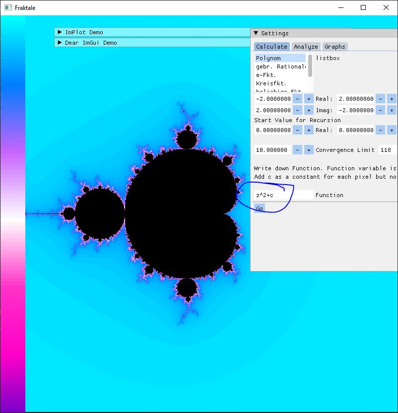
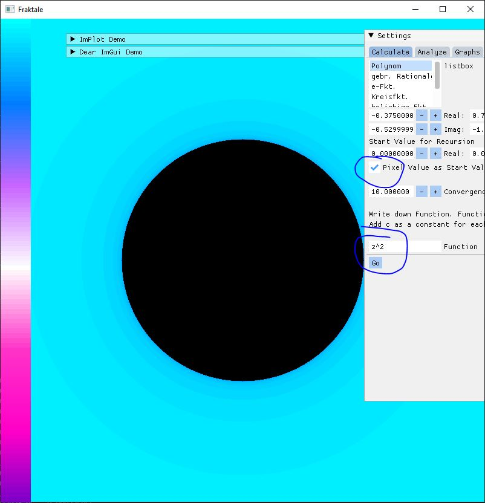
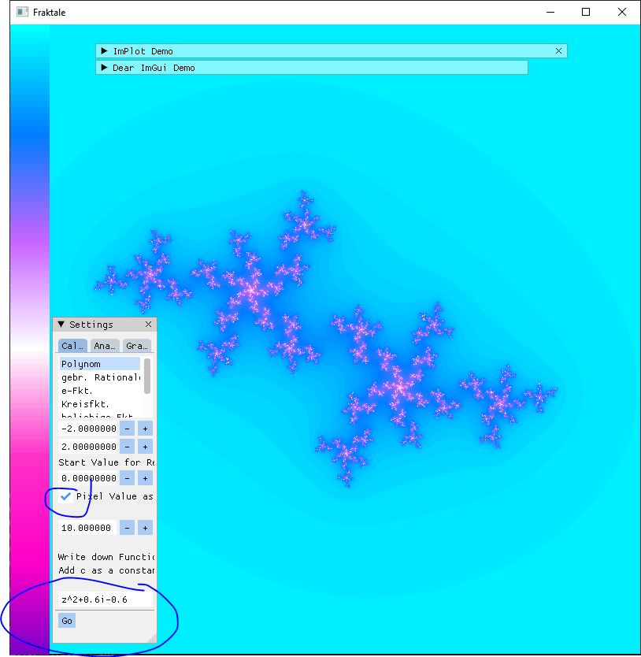

WHY I IMPLEMENTED THIS
================================

Played around with fractals. To explore how different functions behave in complex plane i needed a function parser.
I found exprtk - but as far as i saw it doesnt support complex numbers. Here is a implementation of Exprtk with complex numbers. 
Header only. 3 files: complex.hpp, exprtk_complex.hpp and the original exprtk.hpp; I also included some examples. Here is a impression of the lib in action:

WHY THIS WAY
================================
First i created an own Complex class. But this wasnt as much tested as the std::complex lib - obviously. Implementing all the functions, which can be interpreted by exprtk is quite complex.
So i started to use std::complex itself. But it didnt work. When compiling it tried to use the vector parser for complex numbers. Dont know why. Maybe complex is derived from std::pair?
So there is a ComplexWrapper template class in complex.hpp which uses std::complex , but this isnt visible for the exprtk.

HOW TO USE
=================================
Just copy the 3 files into your project. Remember to always add i or j to your symbol table as the example shows.

EXAMPLE
=================================
I included a snippet from my fractal project (is not on github). There i created a Interpreter class (interpreter_example) which automates adding i/j etc.
Also added the recursion function where i iterate through all pixels and calculate the pixel color (interpreter_usage.hpp). 
Lines 28 to 30 are the part of interest where i set the function variables (as given from function parameters), calculate the new function value (Line 30) and call the function with the new value recursive.

